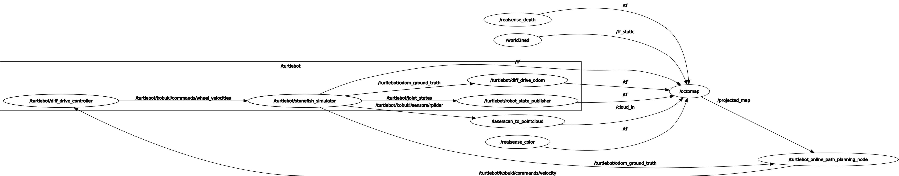
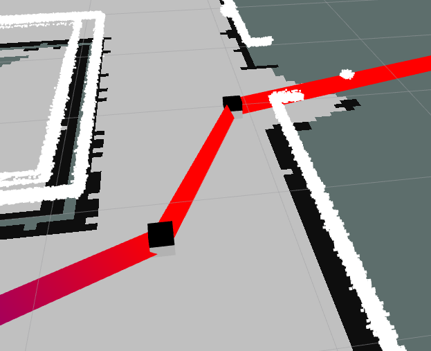

# Online Path Planning ROS Package
By Samantha Caballero Gomez

## Running the Simulation

To run the simulation using the provided commands, follow these steps:

1. Launch the  turtlebot and environment Simulation:
   ```bash
   roslaunch turtlebot_online_path_planning stonefish.launch
   ```
    This command will start the Stonefish simulation with the Turtlebot model.

**!!!! In the simulation it is important to select as fixed frame as: world_ned frame !!!!!!!!!**


2. In seperated window, run turtlebot_online_path_planning_node:
   ```bash
   rosrun turtlebot_online_path_planning turtlebot_online_path_planning_node.py
   ```
    This command will execute the node responsible for the online path planning process.


## Overview

This ROS package implements an online path planning algorithm for robotic navigation. It comprises three main modules: `StateValidityChecker`, `Planner`, and `Controller`. These modules are utilized by the `turtlebot_online_path_planning_node.py` script to generate a sequence of online path planning actions. Additionally, this script manages the connection between the Turtlebot in the Stonefish simulation environment via ROS.

To simplified the sequences, the online path planning process can be depicted as a state machine with the following states:

1. **IDLE State:** The robot waits in the IDLE state until it receives a goal.
2. **Planning State:** Upon receiving a goal, the robot transitions to the Planning state, where the Planner module calculates a path to the goal.
3. **Move to Goal State:** Once a valid path is computed, the robot transitions to the Move to Goal state. Here, the Controller module determines the velocity commands required for the robot to follow the planned path and publishes them to the `/cmd_vel` topic. As the map progress by updating through the new gridmap from `OctoMapServer` node, the validity of the current path is continuously checked by utilizing `check_path()`. If the path becomes invalid due to changes in the environment, the robot returns to the Planning state to recalculate the path.
5. **Recovery State:** If the robot becomes stuck due to obstacles, it enters the Recovery state before planning a new path. The robot ensures its current position's validity by utilizing the `is_valid()` function from the StateValidityChecker module. The recovery action persists until the robot is no longer stuck.

## Publishers

1. **Command Velocity (`/turtlebot/kobuki/commands/velocity`):** Sends velocity commands for robot movement. 

2. **Path Visualization (`/turtlebot_online_path_planning/path_marker`):** Visualizes planned paths in RViz.

3. **Waypoints Visualization (`/turtlebot_online_path_planning/waypoints_marker`):** Visualizes waypoints in RViz.

## Subscribers

1. **Grid Map (`/projected_map`):** Receives grid map data from Octomap Server. 

2. **Odometry (`/turtlebot/odom_ground_truth`):** Subscribes to odometry data for path planning. 

3. **Goal (`/move_base_simple/goal`):** Subscribes to move goals for path planning.

## DELIVERABLES 
### RQT GRAPH 

The communitcation between ROS nodes are illustrated in the figure below.


## Modifications 
### Path Planning with RRT Algorithm

In the planning module, the Rapidly-exploring Random Tree (RRT) algorithm which was implemented in previous labs is used. While the core principles of RRT are followed, I've made modifications in how to verify the validity of the tree's segments.

Previously, we access the configuration space directly. Now, the StateValidityChecker module is integrated, specifically utilizing its `check_path()` function for validation.

Moreover, to adapt to various scenarios, several parameters are adjustable:

- **`max_time`:** Maximum execution time before returning a failure.
- **`delta_q`:** Maximum distance between nodes.
- **`p_goal`:** Probability of selecting a goal point.
- **`dominion`:** Position limit of the node; nodes cannot be generated outside this boundary.


### Recovery Behavior - Vel Controller
For the recovery behavior, it executes before planning if the current pose is not valid, indicating that the robot is too close to an obstacle and unable to plan a path effectively. This can be demonstrated in minute **1:30** of the embedded youtube video. 

The implemented behavior is straightforward: assuming that the robot will collide with the obstacle if it faces it directly, the recovery behavior consists of moving the robot backward at a constant velocity until the current pose is valid again. This ensures that the robot retreats from the obstacle and able to plan the path.

Furthermore, this behaviour control was improved (funcion move_to_point) by adding a conditional check (if abs(angle_diff) < angular_threshold) ensures the robot first corrects its orientation toward the goal before moving forward. By halting forward motion (v=0) when angular error exceeds the threshold, the robot rotates in place until properly aligned. This prevents inefficient sideways/arcing motion, ensuring straight-line movement once aligned, which improves path efficiency and avoids erratic trajectories. The effect of this can be observed at **[minute 1:58](https://www.youtube.com/watch?v=-rBHbc5B8DA&t=118s)** of the [demo video](https://www.youtube.com/watch?v=-rBHbc5B8DA), where this condition is not yet implemented, so the robot turns in weird arcs. After implementation, at **[minute 2:18](https://www.youtube.com/watch?v=-rBHbc5B8DA&t=138s)**, it corrects its direction before heading to the new goal.


### Path Visualization
Previously, the path visualization was published only once upon finishing computation, which was insufficient to represent the current path adequately. Therefore, it has been modified to be published every 2 seconds. 

**!!!! Be sure to add the path as a marker in Rviz subscribing to the topic: /turtlebot_online_path_planning/path_marker!!!!**

Additionally, waypoint visualization has been added to provide a better representation of the current operation. Waypoints can be seen by sphere markers. The figure  illustrates the visualization in Rviz.


 
## Potential Issues
### Robot Collides With Obstacles
In this project, the main focus is not about obstacle avoidance or local planning. The controller implemented here is designed to follow waypoints rather than the actual path. So, there is a risk that the robot may collide with obstacles while navigating due to the radius distance threshold from the obstacle to the path the robot plans to follow before navigating there, the step size between waypoints, or the frequency of path visualization for the robot to follow. 

In the event of a collision, the robot may not immediately detect it, potentially leading to navigation errors. To address this issue, a solution is implemented where the current pose of the robot is integrated into the current path for validity checking. If the current path is found to be invalid, indicating a potential collision, the robot enters a recovering state. After this state, the robot will be able to replan the path to avoid obstacles and resumes navigation.

It's important to note that while this solution improves collision detection and recovery, it may not be effective if the robot becomes trapped in an obstacle while facing outward or sideways. In such cases, the robot may continuously move backward, leading to being stuck in a loop, as it is shown in minute **0:34** of the embedded video at the bottom of this file.

### Non-Optimized Path

The utilization of the RRT algorithm in this package can result in non-optimized paths due to its inherent randomness and lack of focus on finding the most efficient path. As a consequence, there is a potential for the robot to plan a detour path, leading to slower navigation. An example of this can be seen in minute **1:35** of the demo video embedded below. 

To mitigate this issue, it's essential to tune the parameters of the RRT algorithm and provide it with the appropriate domain knowledge. By adjusting these parameters and providing constraints specific to the environment, the RRT algorithm can be guided to generate more optimized paths.

## Demo Video 
[](https://www.youtube.com/watch?v=-rBHbc5B8DA&ab_channel=SamanthaCaballero)
