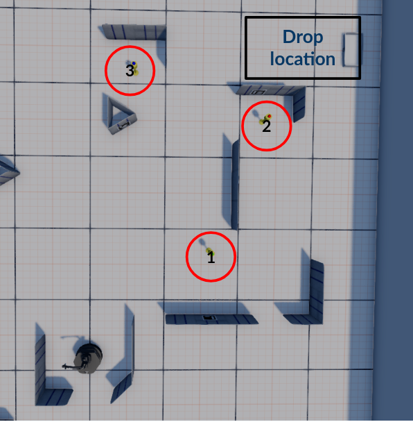

# Define a "Pickup objects" task using behavior trees

This lab combines the [motion planner](https://bitbucket.org/udg_cirs/turtlebot_online_path_planning/src/master/) developed in the previous lab and the [py_trees](https://github.com/splintered-reality/py_trees) library.
Using the turtlebot3 simulator in ROS noetic the idea is to complete an object collecting task.

## `py_trees` library

This lab makes use of the [py_trees](https://github.com/splintered-reality/py_trees) library.
To install the `py_trees` library do:

```bash
pip install py_trees
```

You can find information about how to use this library at this [github page](https://github.com/splintered-reality/py_trees).

There is also a [tutorial](./notebooks/py_tree_tests.ipynb) included in this package. Check it for a brief introduction.

## Task description

We have a robot with the follwong behaviors:

* `move`: The robot move to the *x*, *y* location. This behavior has to be provided by you using the previous lab. If it is not working properly, use the `turtlebot3_stage1` environment instead of `turtlebot3_stage3` and implement a simple `go_to_point` controller without task planning. 
* `check_object`: A service provided by the environmet. It returns `False` if no object is close to the robot and `True` and the object name if an object is close to it.
* `get_object`: A service provided by the environmet. It returns `False` if no object is close to the robot and `True` if an object is close to it. It also moves this object over the robot.
* `let_object`: A service provided by the environmet. It returns `False` if no object is over the robot and `True` if an object is over it. It also moves this object to the floor.


Using these behaviors, you have to implement the following task.
The robot has to navigate to a point and check if there is an object on it. If there is an object, it picks it up and takes it to `(-1.5, -1.5)` if the object was a `beer` can or to `(1.5, 1.5)` if the object was a `coke` can. Once there, the robot leaves the object and goes to the next point. The task ends once two objects have been collected. The points where the objects can be found are:

* (1.25, 0.5)
* (1.25, -1.25)
* (0.0, -1.25)
* (-0.5, 1.25)
* (-1.25, 0.5)

An execution example can be found [here](http://eia.udg.edu/~npalomer/imgs/robotica/BT.mp4).

<p align="center">  </p>

### Included code

Two code files are included: `manage_objects.py` and `pickup_behaviors.py`:

* `manage_objects.py`: This file is a ROS node that contain the following ROS services:
    * `check_object`
    * `get_object`
    * `let_object`
* `pickup_behaviors.py`: Contains 3 behaviors ready to be called from the `py_trees` library. Modify this file to add the necessary additional behaviors.
    * `CheckObject`: Behavior for calling `check_object` task and if True, store object name to Blackboard
    * `GetObject`: Behavior for calling `get_object`
    * `LetObject`: Behavior for calling `let_object`

Additionally, a launch file named `pick_up_objects_task.launch` is also included. Launch it and run the ROS node that plays your behavior tree to execute the autonomous task.


## Work to be done

Define a behavior tree to complete the task at hand. Once the behavior tree is being approved by your lab assistant, implement it using ROS and `py_trees`. Despite there is a `py_trees` implementation for ROS1, here, we propose you to use the standard `py_trees` library and add by hand any necessary call to ROS services, publishers or subscribers. However, feel free to use whatever is more convininent for you.


## Deliverable 

Deliver a zip file containing the necessary packages (motion planning and pick_up_objects_task). For the [pick_up_objects_task](https://github.com/narcispr/pick_up_objects_task) package replace or complete the current `README.md` file with:

* The name of all group members (max. 2)
* If it is required to install some package, detailed instructions of how to do it.
* Detailed instructions of how to execute the task (i.e., launch file, rosrun nodes, ...).
* A figure of the behavior tree you have implemented.
* An explanation of the behavior tree used and how each behavior have been implemented.
* Problems found.
* Conclusions

---

## WARNING:

We encourage you to help or ask your classmates for help, but the direct copy of a lab will result in a failure (with a grade of 0) for all the students involved. 

It is possible to use functions or parts of code found on the internet only if they are limited to a few lines and correctly cited (a comment with a link to where the code was taken from must be included). 

**Deliberately copying entire or almost entire works will not only result in the failure of the laboratory but may lead to a failure of the entire course or even to disciplinary action such as temporal or permanent expulsion of the university.** [Rules of the evaluation and grading process for UdG students.](https://tinyurl.com/54jcp2vb)

---

<sup>
Narcis Palomeras - 
Last review March 2023.
</sup>